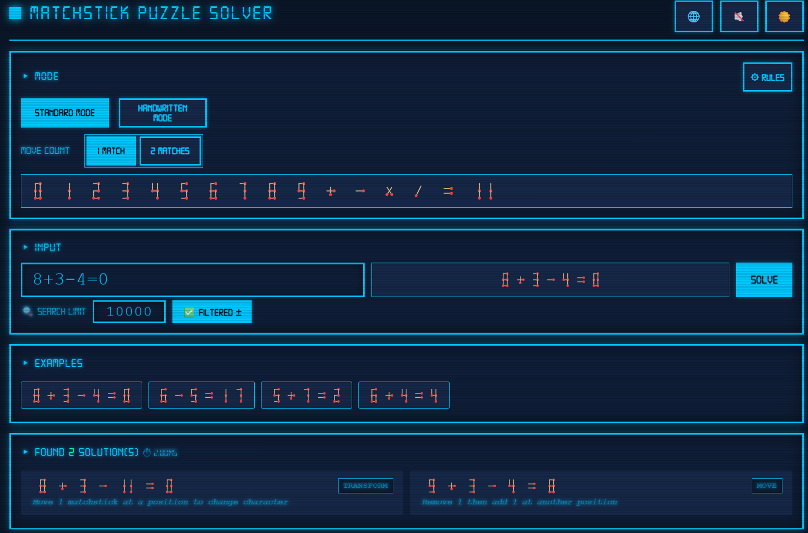

# 火柴棒谜题求解器 🔥

[🇨🇳 中文](#) | [🇬🇧 English](./README.en.md)

**Version: v0.5**

---

一个现代化的火柴棒等式解题工具，支持标准模式和手写模式。

## 特性

- 🎯 **智能求解**: 自动找出所有可能的解
- 🎨 **双模式**: 支持标准模式和手写模式
- 🔀 **移动选择**: 支持1或2根火柴的求解模式
- 🧮 **高级语法**: 支持正负号（=+, =-, 开头+/-）和前导零过滤
- 🔧 **高级配置**: 
  - **搜索上限**: 设置最大搜索次数（默认10000，范围1000-500000），影响求解速度和完整性
  - **过滤正负号解**: 可选择过滤带正负号的等式解（如 `+5-3=2` 或 `5-3=+2`）
- 📊 **详细展示**: 显示求解方法、详细描述和计算时间
- 🖼️ **SVG显示**: 精美的矢量图火柴棒显示，带真实火柴头
- 🎮 **3D 游戏页**: `game.html` 提供火柴燃烧、翻页切题、涂鸦纸张风格的交互挑战
- 🌍 **双语支持**: 中文/英文界面切换
- 🌓 **主题切换**: 亮色/深色主题，主页与规则页同步
- 🎵 **背景音乐**: 支持在页面播放/关闭背景音乐（本地资源）

## 快速开始

```bash
npm run serve
```

然后在浏览器中打开 `http://localhost:8080`

[在线地址](https://8188.github.io/matchstick-puzzle-solver)

## 项目结构

```
matchstick-puzzle-solver/
├── src/
│   ├── core/              # 核心求解模块
│   ├── modes/             # 模式定义（标准模式、手写模式）
│   ├── ui/                # UI层
│   └── utils/             # 工具模块
├── assets/                # 资源文件（字体、图片、音乐）
├── doc/                   # 文档
├── test/                  # 测试文件
├── index.html             # 求解器主页
├── game.html              # 3D 游戏页
├── rules.html             # 规则展示页
└── package.json           # 项目配置
```

## 文档

- 手写模式规则: [doc/hand-written-rules.md](doc/hand-written-rules.md)
- 标准七段数码管模式规则: [doc/stantard-rules.md](doc/stantard-rules.md)

## 测试

```bash
node test/test-solver.js
# 或使用 npm
npm test
```

## 📋 TODO List

未来版本计划实现的功能：

- [x] **双火柴模式**: 支持移动两根火柴的求解模式（✅ v0.2）
- [x] **性能优化**: 剪枝算法、非阻塞求解（✅ v0.3），规则缓存 + Generator 惰性求值，提速 180×（✅ v0.5）
- [x] **统计功能**: 求解时间统计（✅ v0.3）
- [x] **谜题生成器**: 自动生成不同难度的火柴棒谜题（✅ v0.6）
- [x] **提示系统**: 为用户提供分步提示（✅ v0.6）
- [x] **难度分级**: 根据等式复杂度（✅ v0.6）、移动次数和解的数量自动评估难度
- [ ] **自定义规则**: 允许用户自定义火柴转换规则x

## 更新日志

- 查看更新日志: [doc/CHANGELOG.md](doc/CHANGELOG.md)

## 截图



## 许可证

MIT License

## 致谢

受启发于 [narve/matchstick-puzzle-solver](https://github.com/narve/matchstick-puzzle-solver)

- [Three.js](https://threejs.org/)：3D 渲染与火柴模型/动画支持
- [Vanta.js](https://www.vantajs.com/)：动态背景效果

---
